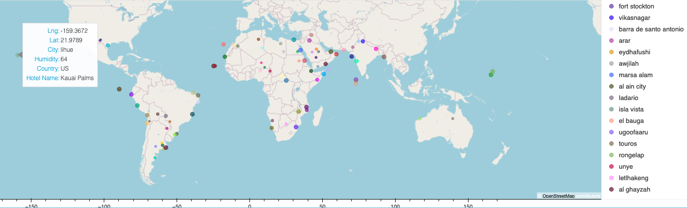

# python-api-challenge

#### Part 1: WeatherPy

In this deliverable, you'll create a Python script to visualize the weather of over 500 cities of varying distances from the equator. You'll use the [citipy Python library**Links to an external site.**](https://pypi.python.org/pypi/citipy), the [OpenWeatherMap API**Links to an external site.**](https://openweathermap.org/api), and your problem-solving skills to create a representative model of weather across cities.

For this part, you'll use the `WeatherPy.ipynb` Jupyter notebook provided in the starter code ZIP file. The starter code will guide you through the process of using your Python coding skills to develop a solution to address the required functionalities.

To get started, the code required to generate random geographic coordinates and the nearest city to each latitude and longitude combination is provided.

### Requirements

1. All plots for **Part 1** and **Part 2** can be found in the **Output** folder.
2. For plots with linear regression modeling is done, an explaination of relationships and trends can be found in the markdown cell of the jupyter notebook.

#### Part 2: VacationPy

In this deliverable, you'll use your weather data skills to plan future vacations. Also, you'll use Jupyter notebooks, the geoViews Python library, and the Geoapify API.

The code needed to import the required libraries and load the CSV file with the weather and coordinates data for each city created in Part 1 is provided to help you get started.

Your main tasks will be to use the Geoapify API and the geoViews Python library and employ your Python skills to create map visualizations.

To succeed on this deliverable of the assignment, open the `VacationPy.ipynb` starter code and complete the following steps:

1. Create a map that displays a point for every city in the `city_data_df` DataFrame as shown in the following image. The size of the point should be the humidity in each city.
   
2. Narrow down the `city_data_df` DataFrame to find your ideal weather condition. For example:

   * A max temperature lower than 27 degrees but higher than 21
   * Wind speed less than 4.5 m/s
   * Zero cloudiness

   **note**Feel free to adjust your specifications but make sure to set a reasonable limit to the number of rows returned by your API requests.
3. Create a new DataFrame called `hotel_df` to store the city, country, coordinates, and humidity.
4. For each city, use the Geoapify API to find the first hotel located within 10,000 meters of your coordinates.
5. Add the hotel name and the country as additional information in the hover message for each city on the map as in the following image:
   

## My Map

